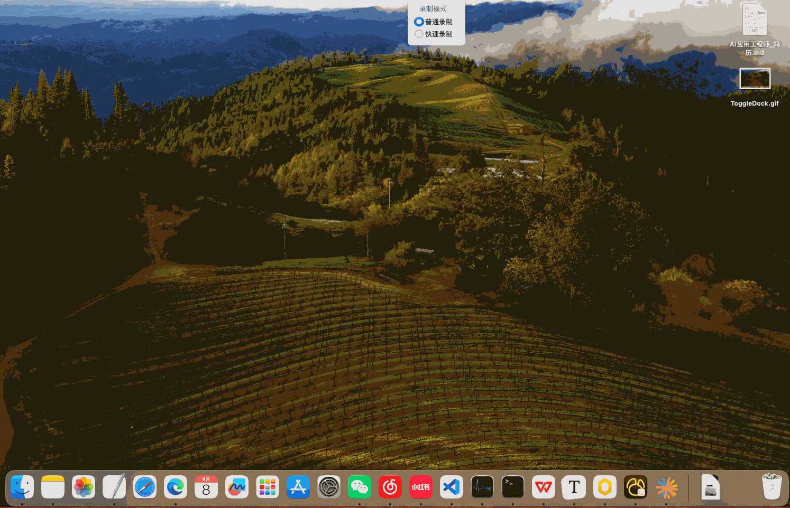

<p align="center">
  <b>ToggleDock</b><br>
  让 macOS 程序坞像 Windows 任务栏：<b>点击前台应用的 Dock 图标收起窗口，再点还原</b>（genie 动画）。
</p>

<p align="center">
  
  
  
</p>

---

## 效果演示

点击前台应用的 Dock 图标收起窗口,再点还原:



## 功能

- **点击收起 / 再点还原** —— 默认最小化（带 genie 动画），可在设置里切换为隐藏（等同 ⌘H）
- **单应用聚焦**（可选）—— 切换应用时自动收起上一个，多屏感知
- **检查更新** —— 在线检测 GitHub 新版本，弹窗提示或打开发布页
- **界面语言** —— 简体中文 / English，即时切换；支持登录时启动

Swift + AppKit 原生实现，无 Electron，整个 .app 约 0.7MB，常驻菜单栏，不占 Dock。

## 安装

> 需要 Apple Silicon（M 系列）Mac，macOS 14 或更高。

1. 从 [Releases](https://github.com/TEARSUNCLE/ToggleDock/releases) 下载 `ToggleDock-1.0.0.dmg`（或 zip）
2. 把 `ToggleDock.app` 拖入「应用程序」
3. 首次打开：右键应用 →「打开」（未做公证，系统会拦截一次）
4. 在 **系统设置 ▸ 隐私与安全性 ▸ 辅助功能** 中授予权限

辅助功能权限用于识别你点击的 Dock 图标；应用不录屏、不联网采集任何数据。

## 构建

```bash
./build.sh        # 零依赖，仅需 Command Line Tools，产物在 build/
swift build       # 或 SwiftPM 方式
```

## License

[MIT](LICENSE)

---

# ToggleDock (English)

Click the frontmost app's Dock icon to collapse its windows (genie animation), click again to restore — like the Windows taskbar. A native Swift + AppKit menu bar app for Apple Silicon (macOS 14+). Requires Accessibility permission. Download from [Releases](https://github.com/TEARSUNCLE/ToggleDock/releases).

## Demo

